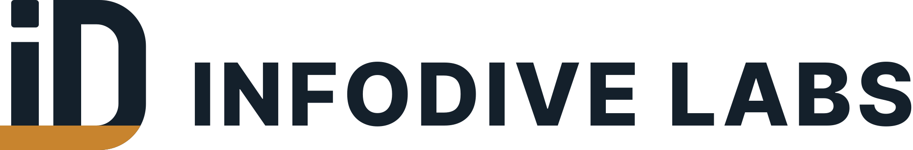

  <picture>
    <source media="(prefers-color-scheme: dark)" srcset="horizontal-reversed-accent.svg">
    
  </picture>

### We build the systems your AI demo can't.

InfoDive Labs is an engineering studio. We take systems the rest of the way: AI-built to production-grade, prototype to production, brittle to hardened, demo to scale. Then we keep operating what we built.

- **An engineer replies, not a salesperson.** Every engagement starts with a call with the engineer who would do the work.
- **If we built it, we're on the pager.** Production ownership, not a handover document.
- **Senior-only.** No bench, no juniors learning on your time.

**What we work on:** AI and machine learning, cybersecurity, cloud, software development, POC to production, startup engineering, blockchain, web3 and DeFi.

Most of our work is under NDA, so the code here is the part we can show. For everything else: [infodivelabs.com](https://www.infodivelabs.com) · [contact@infodivelabs.com](mailto:contact@infodivelabs.com)

India HQ, IST (UTC+5:30). Production work, not slide decks.
